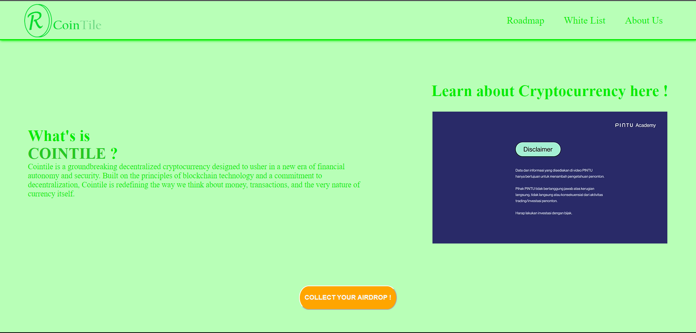

# Table of Content

---
-. [Cointile Project](#cointile-project)
-. [Author](#who-behind-this-project)
-. [Preview & Features](#project-preview-and-features)
-. [Event](#event)
-. [Thanks To](#special-thanks-to)

# CoinTile Project

---

> Cointile is a newly emerging cryptocurrency that aims to revolutionize the digital financial landscape. It is built on advanced blockchain technology, ensuring secure and transparent transactions. Cointile offers fast and low-cost transfers, making it a convenient choice for peer-to-peer payments and international transactions. With a focus on decentralization, Cointile aims to empower users with full control over their assets and data. Its innovative features and strong community support position it as an exciting player in the world of cryptocurrencies, with the potential for widespread adoption in the future

# Who Behind this Project

---

> Alfonsus, a solo developer, is the creative mind behind Cointile, a new cryptocurrency. With vision, determination, and expertise, he embarked on a solitary journey to design, develop, and introduce Cointile to the digital world. Despite the challenges of working alone, Alfonsus demonstrated his remarkable skills and dedication by crafting a secure and efficient cryptocurrency. Cointile is a testament to his innovation and passion, with the potential to make a significant impact in the ever-evolving world of cryptocurrencies.

# Project Preview and Features

---

You can acces CoinTile here : https://cointile.netlify.app/

Features :
- Mobile Friendly apps
- Static & Responsive apps
- Mini-Preview Video
- Modal Form

Some features like navigation bar still underconstruction, just wait for the next update !

# Event 

---

Cointile now hosting an exciting airdrop event! During this event, Cointile is distributing free tokens to its community members and potential users. Participants can simply register or perform specific tasks to receive these tokens as a reward. Airdrops are an excellent way for Cointile to promote its cryptocurrency and engage with its community, allowing people to get a taste of what Cointile has to offer without any initial investment. It's a win-win opportunity for both Cointile and its users, fostering excitement and participation within the cryptocurrency community.

Event Time :
20/10/2023 - 03/11/2023

# Special Thanks to

---

- ChatGPT
- YouTube
- Google
- W3School